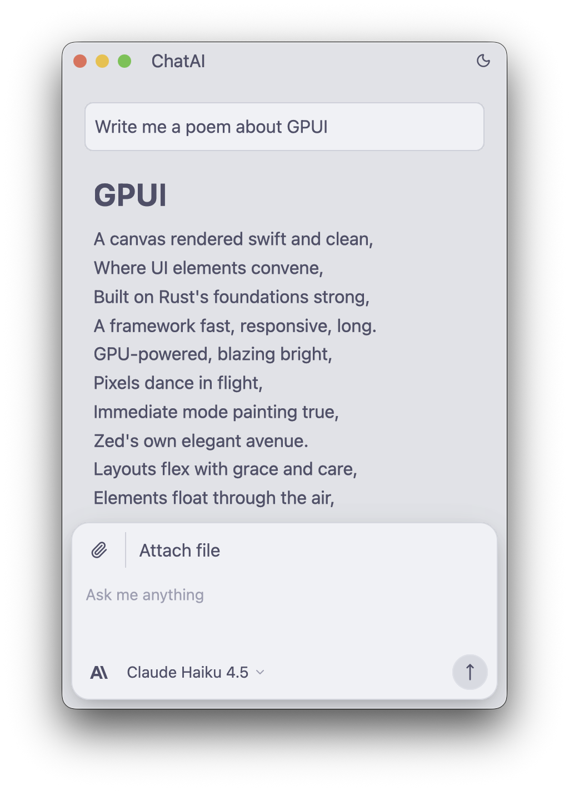
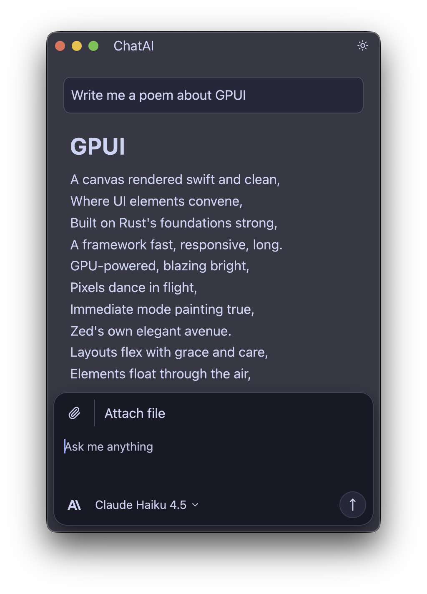

# local-workflow-agent

一个用 Rust 编写的本地工作流智能体框架，目标是把「大模型对话 + 工具调用 + 本地文件/命令执行 + 桌面 GUI」整合到同一个工程里。

当前仓库同时包含两层能力：

1. `local_workflow_agent` 库：提供模型适配、工具系统、权限控制、MCP、上下文管理、会话存储等底层能力。
2. 可运行程序：
   - `src/main.rs`：命令行演示程序，用来展示工具调用和智能体回合循环。
   - `src/bin/agent-gui.rs`：基于 `gpui` 的桌面聊天界面。

## 项目定位

这个项目不是单纯的聊天客户端，而是一个“本地工作流代理”底座。它希望让模型能在受控前提下：

- 读取和编辑工作区文件
- 搜索代码与文本
- 调用命令行工具
- 访问网页
- 接入 MCP 服务器扩展能力
- 在 GUI 中以流式方式展示执行过程

## 当前状态

从当前代码实现来看，项目已经具备以下可用能力：

- 基础库模块划分完整：`api`、`agent`、`core`、`mcp`、`query`、`tools`、`ui`
- 支持流式响应与多轮工具调用
- 提供桌面 GUI，可发送消息、切换模型/Provider、附加文件、查看工具执行结果
- 提供命令行 demo，可直接验证工具系统和回合循环
- 已实现权限处理、AskUser 交互、设置持久化、SQLite/Turso 会话存储模块、MCP 客户端模块

同时也需要说明两个“代码中已有，但当前 GUI 还未完全打通”的部分：

- `core::sqlite_storage` / `core::session_storage` 已经存在并有测试，但当前 GUI 主路径仍以单会话内存状态为主，不是完整的多会话桌面客户端。
- `query` 模块能力比当前 `agent::run_turn` 更重，包含上下文压缩、预算控制、Hook 等高级逻辑，但桌面 GUI 当前主要走的是更轻量的 `run_turn` 流程。

## 功能概览

### 1. 命令行演示

`src/main.rs` 展示了三层能力：

- 直接调用工具，不依赖 LLM
- 将工具转换成模型可消费的工具定义
- 基于 `run_turn` 的流式智能体回合循环

这让项目既能当成库使用，也能作为最小可运行示例。

### 2. 桌面 GUI

当前 GUI 基于 `gpui` 和 `gpui-component`，主要能力包括：

- 聊天输入与流式输出
- 设置面板（Provider / API Key / Base URL / Model / Working Dir）
- 文件附加
- 工具调用状态展示
- 工具权限确认弹窗
- `AskUserQuestion` 交互弹窗
- 取消当前回合
- 主题切换与基础界面资源管理

### 3. 工具调用循环

`src/agent/turn.rs` 中的 `run_turn` 是当前 CLI 与 GUI 共用的核心回合执行器：

- 调用 Provider 获取流式输出
- 累积文本、thinking、tool_use 数据块
- 在 `stop_reason == tool_use` 时执行工具
- 把 `ToolResult` 回填给模型继续推理
- 最多执行 `MAX_TOOL_ROUNDS = 16` 轮，避免死循环

### 4. 多 Provider 适配

`api` 模块不是只绑定 Anthropic。当前代码已经抽象出 `LlmProvider` 接口，并提供：

- Anthropic
- OpenAI
- OpenAI 兼容 Provider
- 若干第三方/本地兼容接入能力，例如 `OpenRouter`、`Groq`、`Mistral`、`DeepSeek`、`xAI`、`Ollama`、`LM Studio`

### 5. MCP 扩展

`mcp` 模块实现了 MCP 客户端能力，包括：

- `tools/list` / `tools/call`
- `resources/list` / `resources/read`
- prompt 模板
- stdio / HTTP / SSE 传输
- 重连与通知分发

这意味着本项目可以把外部 MCP Server 作为新的工具或资源来源。

## 开发文档

- [开发者快速上手](docs/developer-quickstart.md)：介绍如何新增工具、接入 Provider、接入 MCP

## 核心模块分析

### 顶层模块

`src/lib.rs` 暴露了 7 个一级模块：

| 模块 | 作用 |
| --- | --- |
| `api` | 大模型 Provider 抽象、请求/响应模型、流式事件、模型注册表、上传能力 |
| `agent` | 当前 CLI/GUI 共用的轻量回合执行器 `run_turn` |
| `core` | 配置、权限、消息类型、系统提示词、存储、认证、附件、成本统计等基础设施 |
| `mcp` | MCP 客户端、连接管理、资源/工具注册 |
| `query` | 更完整的查询循环：上下文压缩、记忆提取、预算控制、Hook、命令队列 |
| `tools` | 内置工具定义、注册表、上下文与权限封装 |
| `ui` | 基于 GPUI 的桌面界面 |

### `api/`：模型接入层

`src/api/` 是项目的模型访问抽象层，主要职责：

- 定义统一的 `LlmProvider`
- 屏蔽不同模型供应商的差异
- 统一流式事件格式
- 处理模型列表、鉴权、错误、上传

主要子模块：

| 路径 | 说明 |
| --- | --- |
| `provider.rs` | Provider 抽象接口 |
| `provider_types.rs` | 统一请求、响应、停止原因、流事件 |
| `providers/` | Anthropic、OpenAI、OpenAI-Compatible 实现 |
| `registry.rs` | Provider 解析与注册入口 |
| `model_registry.rs` | 模型清单、能力、定价/兼容信息 |
| `stream_parser.rs` | 流式响应解析 |
| `uploads.rs` | 文件上传与内容块转换 |
| `transformers/` | 不同 Provider 间的消息格式转换 |

这一层的价值在于：上层 `agent` 和 `ui` 不必直接关心 Anthropic/OpenAI 的协议细节。

### `agent/`：当前运行时回合循环

`src/agent/` 很聚焦，核心就是把“模型流式输出”和“工具执行”串起来。

关键点：

- `run_turn` 同时服务于 CLI 与 GUI
- 输出事件统一为 `TurnEvent`
- 支持文本 delta、tool use delta、完成、失败、取消
- 发生工具请求时，按顺序调用已注册工具
- 对工具执行做了权限检查与 panic 保护

如果你要理解“这个项目实际怎么跑起来”，`src/agent/turn.rs` 是最值得先看的文件之一。

### `core/`：基础设施层

`src/core/` 是代码量最大、职责最重的一层，承担了项目的大部分基础能力：

- 配置解析与默认值
- 权限模式与权限管理
- 统一消息/内容块类型
- Token / 成本统计
- 附件上下文拼装
- 认证信息存储
- SQLite/Turso 会话存储
- 系统提示词构建
- Skill 发现
- LSP、MCP 模板、目标状态等支撑能力

其中几个比较关键的子模块：

| 路径 | 说明 |
| --- | --- |
| `core::types` | 统一消息模型，定义 `Message`、`ContentBlock`、`ToolResultContent` |
| `core::config` | 全局配置、Provider 配置、权限模式、代理配置 |
| `core::permissions` | 自动放行、交互确认、规则持久化 |
| `core::sqlite_storage` | 基于 `turso` 的 SQLite 会话/消息存储 |
| `core::session_storage` | 另一套会话持久化逻辑 |
| `core::attachments` | 附件上下文装配 |
| `core::system_prompt` | 系统提示词生成 |
| `core::auth_store` | 认证数据存储 |

### `tools/`：工具系统

`src/tools/` 定义了统一的 `Tool` trait，以及工具运行所需的 `ToolContext`。

当前默认注册到 `all_tools()` 的工具包括：

- Shell/命令：`PtyBash`、`PowerShell`
- 文件操作：`Read`、`Edit`、`Write`、`BatchEdit`、`ApplyPatch`
- 搜索：`Glob`、`Grep`
- 网络：`WebFetch`、`WebSearch`
- 任务管理：`TaskCreate`、`TaskGet`、`TaskUpdate`、`TaskList`、`TaskStop`、`TaskOutput`
- 交互与辅助：`TodoWrite`、`AskUserQuestion`、`Skill`
- MCP 资源：`ListMcpResources`、`ReadMcpResource`

此外，`src/tools/` 下还保留了更多扩展/实验性模块，例如 `computer_use`、`cron`、`team_tool`、`lsp_tool`、`monitor_tool` 等，说明这个仓库有继续扩展成更完整 Agent 平台的方向。

### `mcp/`：外部能力接入层

`src/mcp/` 的职责是把 MCP Server 变成本项目可调用的能力来源。

它实现了：

- JSON-RPC 2.0 基础封装
- MCP 协议握手
- 工具列表与调用
- 资源列表与读取
- Prompt 获取
- SSE / HTTP / stdio 传输适配
- 连接管理与通知轮询

如果后续要把数据库、浏览器、云服务、外部知识库接入到本项目，这一层非常关键。

### `query/`：增强型智能体查询引擎

相较 `agent::run_turn`，`query/` 更像是完整“Agent Runtime”：

- 自动上下文压缩
- Token 使用预警
- Tool Result 预算控制
- Hook 执行
- Session Memory 提取
- 命令队列注入
- 预算上限控制
- 多 Provider 推理参数映射

也就是说，`query` 是更偏“生产型工作流引擎”的层，而 `agent` 是更偏“当前 GUI/CLI 主路径”的层。

### `ui/`：桌面交互层

`src/ui/` 是当前用户最直接接触的一层。

主要组成：

| 路径 | 说明 |
| --- | --- |
| `chat.rs` | 主聊天视图 |
| `handler.rs` | 前台 UI 与后台 Agent 的桥接 |
| `settings.rs` | GUI 设置读写 |
| `settings_panel.rs` | 设置面板 UI |
| `permission_modal.rs` | 工具权限弹窗 |
| `ask_modal.rs` | AskUserQuestion 弹窗 |
| `services/agent/` | 对 `local_workflow_agent` 库的 GUI 适配层 |
| `theme.rs` / `window.rs` | 主题与窗口初始化 |

当前 GUI 的结构更接近“单聊天窗口 + 设置抽屉 + 弹窗”，而不是完整的多会话工作台。

## 典型执行流程

### CLI Demo 流程

```text
main.rs
  -> 构建 ToolContext
  -> 直接调用工具（Read / Glob / Grep）
  -> 构建工具定义
  -> 创建 ProviderRequest
  -> 调用 agent::run_turn
  -> 输出流式文本和工具执行结果
```

### GUI 流程

```text
ChatAI
  -> AgentRequest::Chat
  -> ui::handler::handle_outgoing
  -> services::agent::Agent 构造 ProviderRequest
  -> agent::run_turn
  -> TurnEvent 通过 channel 回到前台
  -> ChatAI 渲染流式文本 / 工具状态 / 错误 / 取消结果
```

### 工具调用流程

```text
模型输出 tool_use
  -> run_turn 捕获 ToolUse block
  -> 权限检查
  -> 调用 Tool::execute
  -> 生成 ToolResult block
  -> 作为新的 user message 回填给模型
  -> 模型继续推理直到 end_turn 或达到上限
```

## 目录结构

```text
.
├─ assets/                     图标与截图资源
├─ docs/superpowers/           设计说明与计划文档
├─ src/
│  ├─ api/                     Provider 抽象与实现
│  ├─ agent/                   轻量回合执行器
│  ├─ core/                    配置、权限、存储、类型、提示词
│  ├─ mcp/                     MCP 客户端
│  ├─ query/                   增强型查询循环
│  ├─ tools/                   内置工具系统
│  ├─ ui/                      GPUI 桌面界面
│  ├─ bin/agent-gui.rs         GUI 入口
│  ├─ lib.rs                   库导出
│  └─ main.rs                  CLI demo 入口
├─ tests/                      集成测试
├─ themes/                     主题配置
├─ Cargo.toml
└─ README.md
```

## 环境要求

- Rust 2024 edition
- Windows / Linux / macOS
- 需要可用的模型服务 API Key，至少包括：
  - `ANTHROPIC_API_KEY`
  - `OPENAI_API_KEY`
- 如果切换其他 Provider，则需对应的 Provider 专属环境变量或设置项

## 构建与运行

### 1. 运行命令行 demo

```bash
cargo run
```

### 2. 运行桌面 GUI

```bash
cargo run --bin agent-gui
```

### 3. 运行测试

```bash
cargo test --features gui
```

如果你只想编译不带 GUI 的库/CLI，可以显式关闭默认特性：

```bash
cargo test --no-default-features
```

## 配置说明

### 环境变量

| 变量名 | 作用 |
| --- | --- |
| `LWA_DATA_DIR` | 覆盖 GUI 设置、日志等数据目录 |
| `ANTHROPIC_API_KEY` | Anthropic API Key |
| `OPENAI_API_KEY` | OpenAI API Key |

另外，`core::config` 中还实现了大量 Provider 的 API Key 解析规则，因此在切换到 `deepseek`、`groq`、`mistral`、`openrouter`、`qwen`、`xai`、`ollama` 等 Provider 时，也能按各自环境变量进行解析。

### GUI 设置文件

GUI 设置由 `src/ui/settings.rs` 负责持久化，默认存放在：

- Windows：`%APPDATA%/local-workflow-agent/settings.json`
- Linux/macOS：`~/.config/local-workflow-agent/settings.json`
- 若设置了 `LWA_DATA_DIR`：`$LWA_DATA_DIR/settings.json`

当前设置内容包括：

- `provider`
- `api_key`
- `base_url`
- `model`
- `working_dir`

注意：当前实现中 API Key 以明文形式存储在设置文件内。

## 数据与存储

### 已落地

- GUI 设置：`src/ui/settings.rs`
- 调试日志：`src/bin/agent-gui.rs`
- SQLite/Turso 会话存储实现：`src/core/sqlite_storage.rs`

### 当前状态说明

虽然 `SqliteSessionStore` 已经支持：

- 保存 Session
- 保存 Message
- 会话列表
- 全文搜索
- 删除会话
- 读取消息历史

但当前 GUI 主聊天路径还没有把“完整会话历史管理”彻底接起来，所以现阶段更适合把它理解为“底层能力已就绪，GUI 仍在演进中”。

## 测试

仓库当前包含：

- `agent::run_turn` 相关单元测试
- `tools` 注册与权限相关测试
- `api` 流式解析与构建测试
- `mcp` 客户端和传输测试
- `core::sqlite_storage` 的集成测试

例如 `tests/sqlite_storage_turso.rs` 验证了：

- `save_message` 的幂等性
- `list_messages` 的顺序正确性

## 截图

### 浅色主题



### 深色主题



## 适合从哪里开始读代码

如果你第一次进入这个仓库，推荐按下面顺序阅读：

1. `src/lib.rs`：先了解一级模块划分
2. `src/main.rs`：看最小可运行示例
3. `src/agent/turn.rs`：理解当前实际回合循环
4. `src/tools/mod.rs`：理解工具注册表和 `ToolContext`
5. `src/api/mod.rs`：理解 Provider 层抽象
6. `src/ui/chat.rs` 和 `src/ui/handler.rs`：理解 GUI 如何接到 Agent
7. `src/core/mod.rs`：最后回看底层基础设施

## 总结

`local-workflow-agent` 已经不是一个简单的聊天 demo，而是一个正在成型的本地 Agent 框架：

- 底层能力比较全
- 模块边界已经比较清晰
- GUI 已经可用
- 工具/MCP/Provider 抽象已经成型
- 高级能力（会话持久化、上下文压缩、Hook、预算控制）也已有实现基础

如果后续继续演进，这个仓库很自然可以走向：

- 更完整的多会话桌面工作台
- 更强的本地自动化能力
- 更成熟的 MCP/Skill 生态接入
- 更稳定的生产级 Agent Runtime
